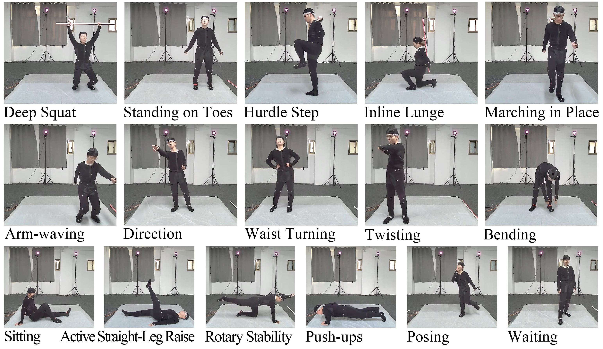

# SATPose

# Introduction
The PVM (Pressure, Vision, Mocap) dataset is a large-scale multimodal human activity dataset, comprising 21 actions that cover both daily activities and fitness exercises. The dataset encompasses data from 20 volunteers (10 males and 10 females) with an average age of 22.9 years (SD = 2.86). It includes GT data, pressure data, 2D keypoint data, and raw images. 

# Download link
[Download link]()

# File Tree

